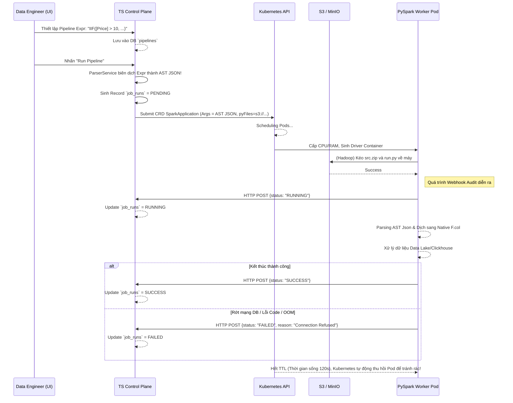

# Đặc Tả Kỹ Thuật (Design Specification): Orchestrator Control Plane

Tài liệu này đặc tả chi tiết về mặt kỹ thuật cho hệ thống **Control Plane (Orchestrator)** viết bằng TypeScript. Đây sẽ là "Bộ não trung tâm" phục vụ cho các Engine dữ liệu phân tán (PySpark, Flink).

---

## 1. Công nghệ Lõi (Tech Stack)

* **Runtime:** Node.js (môi trường xử lý I/O non-blocking tối ưu luồng gọi K8s).
* **Language:** TypeScript (đảm bảo tính chặt chẽ Type-Safety cho cấu trúc JSON Contract).
* **Framework:** NestJS (khuyên dùng NestJS để chuẩn hoá mô hình DI và Service Pattern).
* **Database / ORM:** TypeORM kết nối với **PostgreSQL**.
* **Parser Engine:** `PEG.js` hoặc `nearley` (dùng để sinh AST Json từ Expression string).
* **Infrastructure Client:** `@kubernetes/client-node` (giao tiếp Kubernetes REST API).

---

## 2. Thiết Kế Cơ Sở Dữ Liệu (Database Schema)

Hệ thống Control Plane cần lưu trữ 2 thực thể (Entity) chính trong Postgres:

### `pipelines` (Bảng lưu logic biến đổi Data)
| Field | Type | Description |
|---|---|---|
| `id` | UUID | Khóa chính |
| `name` | String | Tên Pipeline (VD: `Orders_Clean_Job`) |
| `source_db_type` | String | (clickhouse, postgres, iceberg) |
| `source_table_schema`| JSONB | Vd: `{ "database": "ldz", "table": "orders" }` |
| `target_table_schema`| JSONB | Vd: `{ "database": "hmz", "table": "orders", ... }` |
| `transform_rules` | JSONB | Mảng chứa chuỗi Tableau Expressions do người dùng config. Vd: `[{"target": "total", "expr": "IIF([x]>0, 1, 0)"}]` |
| `created_at` | Timestamp | |

### `job_runs` (Bảng Audit theo dõi tiến trình chạy cực quan trọng)
| Field | Type | Description |
|---|---|---|
| `run_id` | UUID | Pk, gửi sang Spark lúc submit làm Token báo cáo |
| `pipeline_id` | UUID | Khóa ngoại trỏ đến `pipelines` |
| `status` | Enum | `PENDING`, `RUNNING`, `SUCCESS`, `FAILED` |
| `error_reason` | Text | Chứa stack code văng lỗi (từ Pod Spark bắn về) |
| `started_at` | Timestamp | Giờ Pod K8s xin tài nguyên |
| `ended_at` | Timestamp | Giờ Spark webhook gửi FAILED/SUCCESS |

---

## 3. Các Module Nghiệp Vụ Chính (Micro-Services Architecture)

CodeBase của Control Plane sẽ chia thành 4 Services cốt lõi:

### 3.1. `ParserService` (Bộ Biên Dịch)
- **Input:** Chuỗi Text Expression lấy từ DB `pipelines.transform_rules`. (vd: `[Giá]*1.2`)
- **Action:** Dùng bộ thư viện Grammar `PEG.js` phân rã nó thành các Token liên kết nhau.
- **Output:** Trả về Component dạng AST JSON Contract (cấu trúc Tree Node: `BinaryOp`, `FunctionCall`) chuyên việt hóa cho PySpark `SparkAstVisitor`.

### 3.2. `JobOrchestratorService` (Bộ Phóng Lệnh K8s)
- **Input:** Object API thông báo "Hãy chạy Pipeline X!".
- **Action:**
  1. Gọi `ParserService` để chuyển đổi Logic String sang AST Json.
  2. Map AST cùng Database config thành cục JSON Tổng `pipelineConfigJson`.
  3. Tạo 1 Record lưu vào bảng `job_runs` với trạng thái `PENDING`.
  4. Lắp ráp Template Kubernetes (`CustomResourceDefinition` dạng SparkApplication).
  5. Inject cục Json tổng vào trường `arguments: [...]`.
- **Output:** Gọi client `@kubernetes/client-node` Push cấu hình này lên Kuberentes Cluster Server !

### 3.3. `AuditingWebhookService` (Bộ Lắng Nghe Kết Quả)
- Cung cấp API Router mở (Endpoint Webhook) để các Worker PySpark Pods dùng HTTP POST gọi về.
- Xử lý việc Update trạng thái Job (RUNNING / FAILED / SUCCESS) tương ứng vào Database `job_runs` để hiển thị trên UI.

---

## 4. Danh Sách APIs (REST Endpoints)

### A. Quản lý Pipelines (Dùng bởi App UI/Frontend)
- `POST /api/v1/pipelines` : Tạo mới thiết kế hệ thống luồng dữ liệu (Gửi mảng String Expression lên).
- `GET /api/v1/pipelines` : Lấy danh sách để hiển thị Data Pipeline Catalog.
- `POST /api/v1/pipelines/:id/run` : Lệnh bằng tay kích hoạt tiến trình tạo Job_Run và bắn K8s Pod.

### B. Audit & Telemetry Webhook (Chỉ dùng bởi PySpark/Flink Worker)
- `POST /api/v1/audit/:run_id/status`
  - *Payload (JSON)*: `{ "status": "RUNNING/SUCCESS/FAILED", "details": {...} }`
  - Nếu `status == 'FAILED'`, kèm field `"error_reason"` để save Message vào Database Audit.

---

## 5. Flow Sequence Diagram (Biểu đồ Hoạt Động Kín)

(Hỗ trợ xem bằng công cụ Mermaid.js hoặc các trình duyệt Github)

